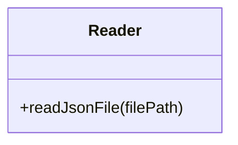
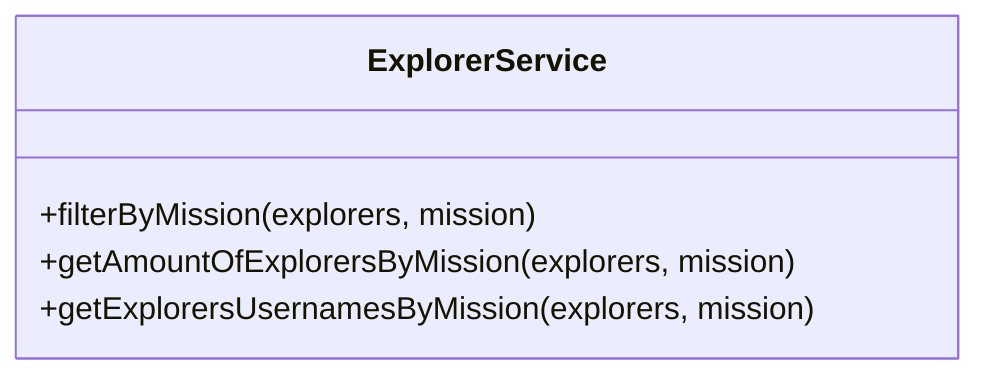
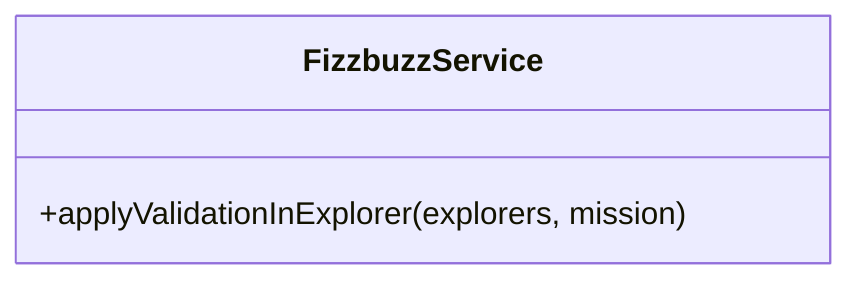
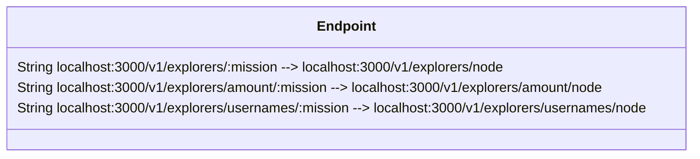

# Proyecto 1 y 2 de la semana 4 de Back end de Launch X
## Clase impartida por Carlo Gilmar

El proyecto 1 consiste en un refactoring de un proyecto dado, que agrega un valor a cada usuario de una lista, el valor de FIZZ si es que su valor: "score" es un multiplo de 3 ó un BUZZ si es que el "score" es un múltiplo de 5. Aplica FIZZBUZZ si es un múltiplo tanto de 3 cómo de 5

Modularizamos el código de la siguiente manera

## Parte 2 Creacion de una API para desplegar las funciones
Creamos nuestro endpoint localhost:3000/v1/explorers/:mission en mission podemos ingresar node o java

